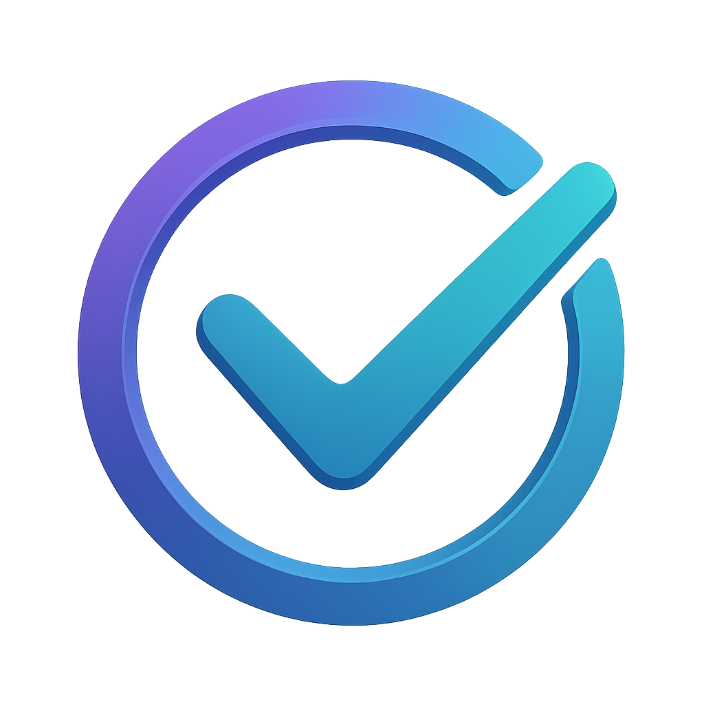

<br />
<div align="center">
  
  <h3 align="center">Remi (Reminder Bot)</h3>
  <p align="center">
    A bot that helps not to forget about important events
  </p>
</div>

<!-- TABLE OF CONTENTS -->
<details>
  <summary>Contents</summary>
  <ol>
    <li>
      <a href="#about-the-project">About the Projec</a>
    </li>
    <li>
      <a href="#getting-started">Get Started!</a>
      <ul>
        <li><a href="#prerequisites">Create Your Own Remi</a></li>
        <li><a href="#installation">Installation & Launch</a></li>
      </ul>
    </li>
    <li><a href="#usage">Usage</a></li>
    <li><a href="#roadmap">Roadmap</a></li>
    <li><a href="#contact">Contact</a></li>
  </ol>
</details>


<!-- ABOUT THE PROJECT -->
## About the Project

The goal of this project is to provide a convenient environment for logging events and receiving reminders about them wherever you are, on any device.

This project differs from Telegram’s built-in scheduled message feature in that:
1. You can not only receive a notification but also reschedule it to a more convenient time.
2. You can view all upcoming events in one place without switching apps, chats, or devices. The bot will show you every scheduled event.
3. You can easily modify reminder parameters: title, date, or time—no need to delete and recreate messages.
4. Future enhancements will include: setting additional pre-event notifications, support for group chats, and a web service with a Gantt chart and statistics.


<!-- GETTING STARTED -->
## Get Started!

Try the bot right now: [RemiMeBot](https://t.me/RemiMeBot)

### Create Your Own Remi

All source code is available publicly. You can deploy the service on your own server for personal use.
Your server needs Docker Compose v2.16.0 or newer.

### Установка и запуск

A couple more steps to launch the bot:

1. Register your bot via <a href="https://t.me/BotFather">@BotFather</a> and obtain an API key. <br>
See the <a href="https://core.telegram.org/bots/features#botfather">official docs</a><br>
Don’t forget to set the bot commands under Edit Commands:<br>
   ```
    help - Learn more
    start - Begin interaction
    timezone - Change your time zone
    new_task - Create a new reminder
    show_tasks - List your reminders
   ```
2. Clone the repository:
   ```
   git clone https://github.com/sa1nttony/ReminderBot
   ```
3. In the `environments` folder, create a `.env` file:
   ```
   \---ReminderBot
   |   \---environments
   |   |   +---.env
   ```
4. Place your API key in `.env` like this:
   ```
   TOKEN = 'Your_API_Key_here'
   ```
5. From the project root run:
   ```
   docker compose up -d
   ```
6. That’s it—start chatting with your bot!

<!-- USAGE EXAMPLES -->
## Usage

It’s easy to use—send /start and share your location to receive notifications in your local time. Then create reminders with /new_task. To edit or cancel reminders, use /show_tasks and choose the reminder you wish to modify.
<!-- ROADMAP -->
## Roadmap:

- [x] <strong>Create reminders</strong>
- [x] <strong>Receive notifications</strong>
- [x] <strong>Edit and delete reminders</strong>
- [x] <strong>Handle user time zones</strong>
- [x] <strong>Reschedule reminders</strong>
- [ ] <strong>Add pre-event notifications</strong>
- [ ] <strong>Provide calendar-based date/time selection</strong>
- [ ] <strong>Build a web service with a Gantt chart and statistics</strong>


<!-- CONTACT -->
## CONTACT

I’d love to answer questions or hear your suggestions for improving the project.

Telegram: [@sa1nttony](https://t.me/sa1nttony)

Email: [sa1ntholytony@yandex.ru](mailto:sa1ntholytony@yandex.ru)
